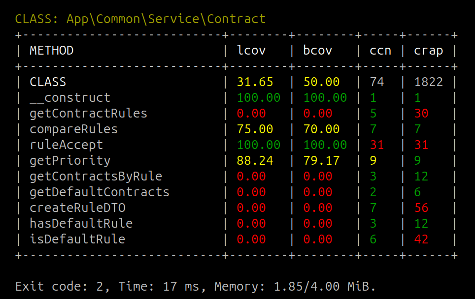

# PHPUnit Cobertura Formatter



[](https://packagist.org/packages/andrey-tech/phpunit-cobertura-formatter-php)
[](https://github.com/andrey-tech/phpunit-cobertura-formatter-php/actions/workflows/php.yml)
[](//packagist.org/packages/andrey-tech/phpunit-cobertura-formatter-php)
[](https://packagist.org/packages/andrey-tech/phpunit-cobertura-formatter-php)
[](https://packagist.org/packages/andrey-tech/phpunit-cobertura-formatter-php)

PHPUnit Cobertura Formatter is a tool to show code coverage metrics, measured by
[PHP Unit](https://docs.phpunit.de/en/12.2/code-coverage.html#software-metrics-for-code-coverage) in
[Cobertura](https://github.com/cobertura/cobertura) format,
in console and CI/CD pipeline.


## Installation

The PHPUnit Cobertura Formatter requires:

- [PHP](https://www.php.net) version 8.3 or higher
- [Composer](https://getcomposer.org)

To install via Composer:

```shell
composer require --dev andrey-tech/phpunit-cobertura-formatter-php
```


## Command line options

```shell
./vendor/bin/phpunit-cobertura-formatter <path to Cobertura XML file>
```

The PHPUnit Cobertura Formatter tool command line interface also accepts the following optional arguments:

- `--init` — Will generate a default config file `phpunit-cobertura-formatter.yml.dist` in current working directory.
- `--config-file` — The filepath to a custom config YAML file.
- `--filter-class-name` — The filter results by class name (regex).   
- `--ignore-red-metrics-on-exit` —  Will exit with a zero code, even "red" metrics exist.
- `--ignore-yellow-metrics-on-exit` —  Will exit with a zero code, even "yellow" metrics exist.
- `--no-colors` — Disable colors in console.

An example command line of PHPUnit Cobertura Formatter tool:

```shell
./vendor/bin/phpunit-cobertura-formatter ./var/cobertura.xml --config-file=./phpunit-cobertura-formatter.yml.dist
```

An example of console output:

```text
CLASS: App\Common\Service\Contract
+---------------------------+--------+--------+-----+------+
| METHOD                    | lcov   | bcov   | ccn | crap |
+---------------------------+--------+--------+-----+------+
| CLASS                     | 31.65  | 50.00  | 74  | 1822 |
| __construct               | 100.00 | 100.00 | 1   | 1    |
| getContractRules          | 0.00   | 0.00   | 5   | 30   |
| compareRules              | 75.00  | 70.00  | 7   | 7    |
| ruleAccept                | 100.00 | 100.00 | 31  | 31   |
| getPriority               | 88.24  | 79.17  | 9   | 9    |
| getContractsByRule        | 0.00   | 0.00   | 3   | 12   |
| getDefaultContracts       | 0.00   | 0.00   | 2   | 6    |
| createRuleDTO             | 0.00   | 0.00   | 7   | 56   |
| hasDefaultRule            | 0.00   | 0.00   | 3   | 12   |
| isDefaultRule             | 0.00   | 0.00   | 6   | 42   |
+---------------------------+--------+--------+-----+------+

Exit code: 2, Time: 17 ms, Memory: 1.85/4.00 MiB.
```

## Software metrics

PHPUnit Cobertura Formatter tool shows metrics, measured by PHP Unit, 
in `green`, `yellow` and `red` colors in the console,
according to boundaries for values, defined in configuration YAML file.

This table shows a list of the software metrics by PHPUnit Cobertura Formatter tool
for classes and methods.
The table also shows the default values for `red`/`yellow`/`green` boundaries of software metrics.


| Metric | Description                                                                                                    | Class   | Method  |
|--------|----------------------------------------------------------------------------------------------------------------|---------|---------|
| lcov   | [Line Coverage](https://docs.phpunit.de/en/12.2/code-coverage.html#software-metrics-for-code-coverage), %      | 0/1/100 | 0/1/100 |
| bcov   | [Branch Coverage](https://docs.phpunit.de/en/12.2/code-coverage.html#software-metrics-for-code-coverage), %    | 0/1/100 | 0/1/100 |
| ccn    | [Cyclomatic Complexity Number](https://phpmd.org/rules/codesize.html#cyclomaticcomplexity)                     | —       | 11/8/7  |
| crap   | [Change Risk Analysis and Predictions Index (CRAP)](https://www.artima.com/weblogs/viewpost.jsp?thread=210575) | —       | 30/-/29 |


## Configuration YAML file

By PHPUnit Cobertura Formatter tool is looking for following configuration YAML files is current working directory:
- `phpunit-cobertura-formatter.yml`,
- `phpunit-cobertura-formatter.yml.dist`.

Configuration YAML file allows to set color boundaries for values of software metrics.

PHPUnit Cobertura Formatter tool currently defines three color boundaries:

| Color    | Description |
|----------|-------------|
| `green`  | Ok          |
| `yellow` | Warning     |
| `red`    | Error       |

A white value means there are no defined color boundaries for this metric.

> You can also add/set custom colors and styles.
> See [How to Color and Style the Console Output](https://symfony.com/doc/current/console/coloring.html) in Symfony console.

The default configuration file:  
```yaml
colorizer:
  metrics:

    # Metrics of class
    class:

      lcov:
        green: [ 100, 100 ]
        yellow+bold: [ 1, 99 ]
        red+bold: [ 0, 1 ]

      bcov:
        green: [ 100, 100 ]
        yellow+bold: [ 1, 99 ]
        red+bold: [ 0, 1 ]

    # Metrics of method
    method:

      lcov:
        green: [ 100, 100 ]
        yellow+bold: [ 1, 99 ]
        red+bold: [ 0, 1 ]

      bcov:
        green: [ 100, 100 ]
        yellow+bold: [ 1, 99 ]
        red+bold: [ 0, 1 ]

      ccn:
        green: [ 1, 7 ]
        yellow+bold: [ 8, 10 ]
        red+bold: [ 11 ]

      crap:
        green: [ 0, 29 ]
        red+bold: [ 30 ]
```

## Exit codes

PHPUnit Cobertura Formatter tool defines four different exit codes:

| Code | Description                                                                                           |
|------|-------------------------------------------------------------------------------------------------------|
| 0    | This exit code indicates that everything worked as expected without "red" or "yellow" metrics         |
| 1    | This exit code indicates that an error/exception occurred which has interrupted tool during execution |
| 2    | This exit code means that tool has processed the Cobertura file with "red" metrics                    |
| 3    | This exit code means that tool has processed the Cobertura file with "yellow" metrics                 |


## Authors and Maintainers

The author and maintainer of PHPUnit Cobertura Formatter is [andrey-tech](https://github.com/andrey-tech).

## License

This tool is licensed under the [MIT license](./LICENSE).
